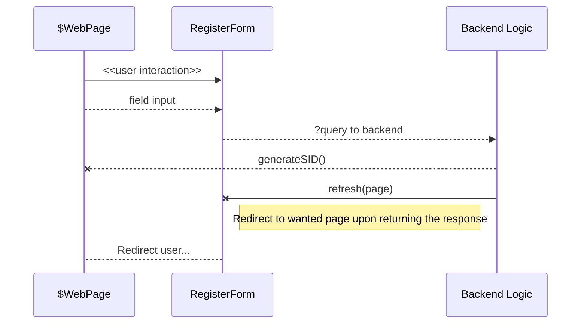

# **Dog.ly**

[Mermaid](https://mermaidjs.github.io/)

**Korisničko uputstvo**

**Verzija 1.0**

**Istorija revizija**

| **Backend** | **Tech Choice 1** | **Tech Choice 2** | **Styles** |
| --- | --- | --- | --- |
|  |  |  |  |

# **Sadržaj**

 - 1.Uvod 
 - 2.Početna stranica aplikacije 
 - 2.1 Kviz – odaberite pravu rasu 
 - 3.Prijavljivanje korisnika na aplikaciju 
 - 3.1Registracija novog korisnika 
 - 3.2Prijava prethodno registrovanog korisnika 
 - 3.3 U slučaju da je prethodno registrovan korisnik zaboravio šifru 
 - 4.Oglasi 
 - 4.1 Filtriranje oglasa po tipu 
 - 4.2 Dodavanje novog oglasa 
 - 4.3 Izmena oglasa 
 - 5.Saveti 
 - 5.1 Pregled komandi dresure 
 - 6.Moj Profil 
 - 6.1Izmena profila 
 - 6.2Promena šifre 
 - 7.Objekti 
 - 7.1Pretraga objekata prema tipu 
 - 7.2 Ostavljanje recenzije 
 - 8.Stranica 404
 - 9.Admin stranica

> **Note:** Ovaj **Sadrzaj** nije interaktivnog tipa.

**Korisničko uputstvo za Dogly aplikaciju**

# 1Uvod

Primarni cilj Dogly aplikacije je da objedini sve potrebe jednog prosečnog vlasnika psa. Naša aplikacija nudi mogućnost registrovanja korisnika, kako bi on imao potpuno korisničko iskustvo i dobio pristup svim delovima aplikacije. Ovo je jedna objedinjena platforma, na kojoj vlasnici pasa mogu pronaći savete vezane za dresuru svojih ljubimaca ali i saznati karakteristike pojedinih rasa pasa ukoliko su u dilemi da li da usvoje psa. Naša aplikacija takođe sadrži i stranicu sa oglasima, gde se ljudi koji nude različite servise i usluge za pse mogu oglašavati, znajući da se tako obraćaju adekvatnoj ciljnoj grupi. Takođe na našoj aplikaciji postoji i deo rezervisan za hitne oglase, gde ukoliko se neki pas izgubi, vlasnik može postaviti hitan oglas sa najvažnijim informacijama, i na taj način skrenuti pažnju ostalim korisnicima aplikacije, kako bi što pre pronašao svog ljubimca. Pored ovoga, imamo i jednu stranicu sa objektima, gde se objekti mogu prvo filtrirati po svom tipu, a nakon toga pronalaziti na mapi grada. Prijavljeni korisnik je u mogućnosti da menja informacije o sebi poput imena, prezimena i šifre, da ima uvid u svoje sačuvane objekte ili postavljene oglase. Ova aplikacija dostupna je kako na srpskom, tako i na engleskom jeziku.

#

#

# 2 Početna stranica aplikacije

Početna stranica aplikacije izgleda kao na sledećoj slici:

Slika 1 – Početna stranica aplikacije

# 3 Prijavljivanje korisnika na aplikaciju

Korisnik se na aplikaciju može prijaviti jedino ako je pre toga registrovan, u suprotnom korisnik se vodi kao posetilac aplikacije. U tom slučaju, on ima pristup pregledu osnovnih podataka o aplikaciji (početna stranica) i savetima, tačnije domen njegovih mogućnosti u tom slučaju je ograničen.

## 3.1 Registracija novog korisnika

1. Korisnik se nalazi na početnoj stranici, a klikom na polje _Registracija_ u navigacionom baru, korisnik se vodi na stranicu predviđenu registraciji korisnika – **Register.html**. Stranica je na srpskom jeziku, ali korisnik ima mogućnost da odabere engleski jezik, pri čemu se ceo sadržaj stranice prevodi.
2. Na ovoj stranici nalazi se forma sa poljima gde korisnik treba da unese svoje ime, prezime i korisničko ime, takođe i e-mail adresu, kao i unos šifre(ona mora da sadrži bar jedan numerički karakter i bar po jedno malo i veliko slovo, a dužina mora biti najmanje 8 karaktera), kao i potvrdu šifre. Ova polja su obavezna, i posetilac ne može da nastavi sa registracijom ukoliko ih ne unese.
3. Korisnik na dnu forme ima i opciju _Već imaš nalog?,_ na čiji klik se korisnik preusmerava na stranicu za prijavu – **Login.html.**
4. Nakon klika na dugme _Registruj se,_ korisnik biva registrovan na aplikaciju, a njegovi podaci pamte se u bazi podataka.
5. Korisniku se potom otvara **WelcomeEmailSent.html** stranica, koja obaveštava korisnika da mu je na mail adresu stigao kofirmacioni mejl, kako bi potvrdio svoju registraciju.

Slika 4 –Registracija korisnika

Slika 5 – Mejl dobrodošlice

## 3.2 Prijava prethodno registrovanog korisnika

1. Korisnik sa početne stranice može da odabere u navigacionom baru opciju Prijava, nakon čega se on preusmerava na stranicu predviđenu prijavljivanju - **Login.html.** Stranica je na srpskom jeziku, ali korisnik ima mogućnost da odabere engleski jezik, pri čemu se ceo sadržaj stranice prevodi.
2. Na ovoj stranici nalazi se forma sa poljima za e-mail adresu i šifru, koja korisnik treba da popuni kako bi se prijavio na aplikaciju.
3. Ukoliko korisnik nije prethodno registrovan, klikom na dugme _Registruj se_, korisnik se preusmerava na stranicu za registraciju – **Register.html**
4. U suprotnom, klikom na dugme _Prijavi se_, korisnik biva prijavljen na aplikaciju.
5. Na ovoj stranici takođe postoji i opcija _Zaboravili ste šifru?_, na čiji klik se korisnik preusmerava na stranicu **Forgotpass.html.**

Slika 6 – Prijava korisnika

## 3.3 U slučaju da je prethodno registrovan korisnik zaboravio šifru

1. Sa stranice **Login.html,** nakon odabira opcije _Zaboravili ste šifru?_, korisnik se preusmerava na ovu stranicu
2. Na stranici se nalazi forma sa poljima za popunjavanje nove šifre (ona mora da sadrži bar jedan numerički karakter i bar po jedno malo i veliko slovo, a dužina mora biti najmanje 8 karaktera), kao i poljem za potvrdu šifre.
3. Nakon popunjavanja ovih polja, klikom na dugme _Resetuj šifru_, korisnik dobija novu šifru kojom sada može da se prijavljuje na aplikaciju.

Slika 7 – Korisnik koji je zaboravio šifru

# 4 Oglasi

Stranicaoglasipredviđenajeoglašavanjuljudikojinudenekuodponuđenihvrstauslugazapse – šetanje, šišanje, usvajanje, čuvanje, parenje, prodajuili dresuru. Na stranici se nalaze i hitni oglasi, koje postavljaju vlasnici pasa u slučaju da se njihov ljubimac izgubi.

## 4.1 Filtriranje oglasa po tipu

1. Korisnik bira željene tipove oglasa koje želi da mu se prikažu
2. Odmah zatim, ispod se prikazuje lista oglasa željenog/željenih tipova, gde se za svaki oglas jasno vidi naslov oglasa, korisničko ime korisnika koji je postavio oglas, njegov kontakt telefon, opis oglasa, kao i datum postavljanja oglasa i datum poslednje izmene oglasa

Slika 8 – Oglasi

## 4.2 Dodavanje novog oglasa

Na stranici Oglasi, klikom na dugme _Dodaj oglas +_, korisniku se prikazuje forma za dodavanje oglasa.

1. Korisnik ima izbor da čekira opciju _Da_ ili opciju _Ne_, u zavisnosti od toga da li je njegov oglas hitan oglas

1.1. Ukoliko oglas nije hitan, na formi oglasa, korisnik može da odabere tip svog novog oglasa birajući jedan od ponuđenih tipova

1.2. Ukoliko oglas jeste hitan, korisnik ne treba da bira tip oglasa

1. Nakon toga, korisnik ima polje za upis, gde upisuje naslov oglasa koji će se prikazivati ostalim korisnicima
2. Korisnik u polju za opis oglasa, daje osnovne informacije o svom oglasu i podatke
3. Korisnik ima dva dugmeta i bira jedno, u zavisnosti od toga da li želi da postavi svoj oglas ili da odustane
4. Korisnik koji kreira oglas, takođe ima i opciju za doniranje sredstava azilu Riska, klikom na dugme _Doniraj_, koje ga potom preusmerava na istoimeni web sajt

Slika 9 – Dodavanje oglasa

## 4.3 Izmena oglasa

Ukoliko autor oglasa poželi da izmeni svoj oglas, on to može lako uraditi koristeći formu namenjenu izmeni oglasa, tako što će uneti novi naziv oglasa, kontakt telefon i opis. Odabirom jednog od dva dugmeta, korisnik može izmeniti oglas ili odustati.

Slika 10 – Izmena oglasa

# 5 Saveti

Stranica saveti je stranica kojoj mogu da pristupe kako registrovani korisnici, tako i posetioci aplikacije. Na ovoj stranici nalazi se odeljak Najčešće rase, gde korisnik može da se informiše o osobinama i karakteristika nekih najčešćih rasa pasa na našim prostorima, i odeljak Dresura, sa nekim osnovnim komandama i instrukcijama koje pas može da nauči

# 6 Moj Profil

Prethodno registrovan, prijavljeni korisnik sa početne stranice – **Index.html** iz navigacionog bara, može pristupiti stranici **Profile.html.** Na ovoj stranici korisnik ima mogućnost da izmeni svoj avatar jednim od ponuđenih 8 avatara, da izmeni svoje podatke. Na stranici postoji odeljak _Moji oglasi_, gde se nalaze svi korisnici koje je taj korisnik prethodno postavio na aplikaciju, i odeljak _Sačuvano_, gde korisnik može dobiti uvid u objekte koje je sačuvao.

Slika 13 – Stranica moj profil

## 6.1 Izmena profila

1. Klikom na dugme _Izmeni profil_, korisnik dobija karticu na kojoj može da izmeni ime i prezime, popunjavajući istoimena polja za unos
2. Odabirom jednog od dva ponuđena dugmeta, korisnik može da sačuva svoje nove podatke ili da odustane od izmene profila

Slika 14 – Izmena imena i/ili prezimena

## 6.2 Promena šifre

1. Klikom na dugme _Promeni šifru_, korisnik ima mogućnost izmene svoje šifre, tako što će u kartici koja se pojavila, popuniti polja stare šifre, nove šifre i ponovo uneti svoju šifru.
2. Odabirom jednog od dva ponuđena dugmeta, korisnik može da sačuva svoju novu šifru ili da odustane od promene šifre

Slika 15 – Promena šifre

# 7 Objekti

Stranica posvećena objektima potrebnim vlasnicima pasa, kao što su Veterinari, PetShop-ovi, Hoteli za pse i Frizeri za pse, koji se mogu pronaći na mapi grada i kojima se mogu davati recenzije. Na dnu stranice nalaze se Pet Friendly objekti teritoriji grada Niša.

## 7.1Pretraga objekata prema tipu

Korisnik ima mogućnost da na mapi pronađe sve objekte određenog tipa na teritoriji grada, tako što će iz liste izabrati jedan od ponuđenih tipova, a zatim kliknuti na dugme _Pretraži._

Slika 16 – Pretraga prema tipu

U slučaju da korisnik želi da pronađe neki objekat kome već zna naziv, to može učiniti preko search bar-a.

Korisniku se nakon klika na dugme izlistavaju svi objekti odabranog tipa, gde svaki objekat sadrži naziv, opis, datum poslednje izmene. Za bilo koji od izlistanih objekata, korisnik ima mogućnost da ostavi recenziju.

## 7.2 Ostavljanje recenzije

1. Klikom na + u donjem desnom uglu bilo kojeg od objekata, korisnik dobija mogućnost ostavi recenziju. Na taj način korisnik dobija uvid u prethodne recenzije tog objekta.
2. Ako odluči da ostavi recenziju, korisnik u poljima za upis dodaje naslov svoje recenzije, samu recenziju kao i da oceni objekat vrednošću od 1 o 5.
3. Odabirom jednog od dva ponuđena dugmeta, korisnik može postavi recenziju ili da od nje odustane.

Slika 17 – Ostavljanje recenzije

# 8_Stranica 404_

Greška 404 (error 404: Not Found) ukazuje na to da je korisnik uspeo da uspostavi vezu sa serverom ali server nije pronašao ono što je traženo. Korisnik ima mogućnost da se sa ove strane vrati na početnu stranu aplikacije.

Slika 18 – Stranica nije pronađena

# 9Admin stranica

Ovoj stranici pristup ima isključivo administrator kada se prijavi na svoj nalog, i na taj način on uživa svoje privilegije.

Slika 19 – Administratorov pregled aplikacije
